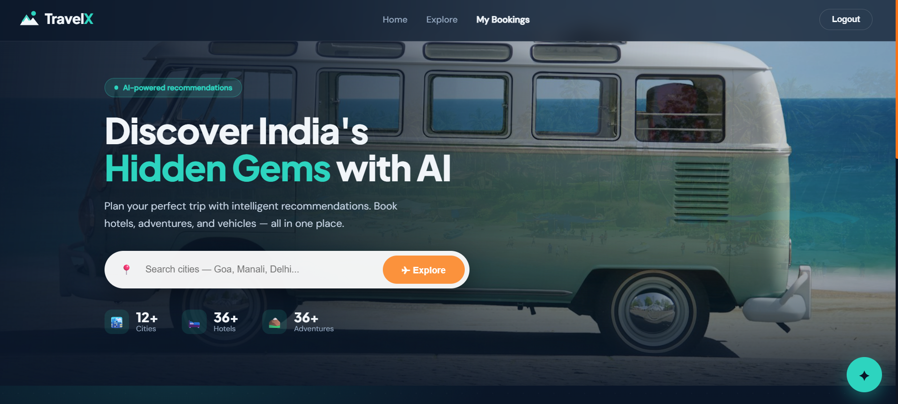
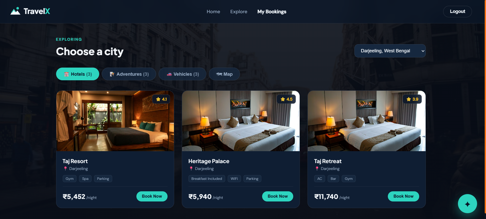
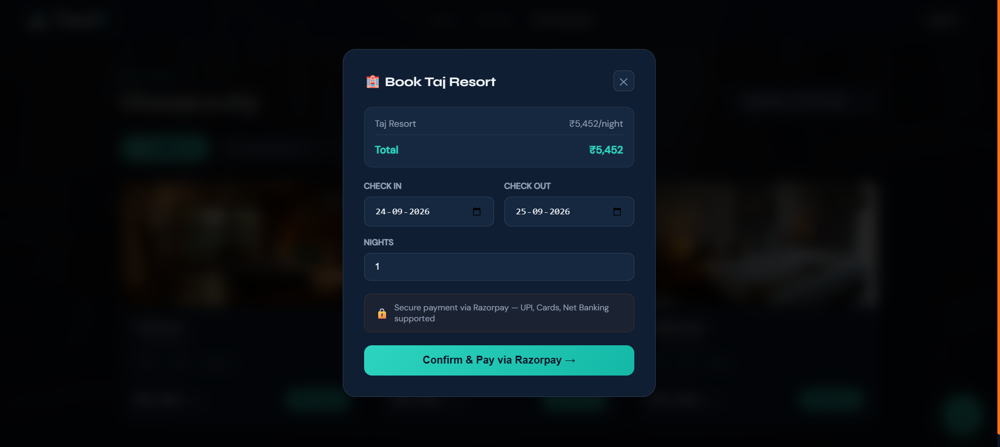

<div align="center">

# ✈️ TravelX

### AI-Powered Travel Booking Platform

*Discover India's hidden gems — book hotels, adventures, and vehicles, planned intelligently with AI.*

[](https://www.djangoproject.com/)
[](https://react.dev/)
[](https://www.postgresql.org/)
[](https://www.docker.com/)
[](LICENSE)

[Live Demo](#-live-demo) · [Features](#-features) · [Tech Stack](#️-tech-stack) · [Quick Start](#-quick-start) · [Architecture](#️-architecture)

</div>

---

## 📸 Screenshots

<!--
  Replace these with your own screenshots.
  1. Take screenshots of your running site (Home, Explore, Booking).
  2. Create a folder `screenshots/` in your repo root.
  3. Save them as home.png, explore.png, booking.png inside it.
  4. The paths below will then work automatically.
-->

<div align="center">

| Home | Explore | Booking |
|:----:|:-------:|:-------:|
|  |  |  |

</div>

---

## 🎯 Overview

**TravelX** is a full-stack, production-minded travel platform where users can plan trips end to end — from browsing destinations to paying securely — with an AI assistant that helps them decide.

What makes it more than a CRUD app: **real concurrency handling, event-driven design, secure payments, and an AI layer** — the kind of engineering that shows up in production systems.

**Users can:**
- 🔍 Browse **12+ Indian cities** with hotels, adventures & vehicles
- 🏨 Book hotels with real-time availability and ratings
- 🧗 Reserve adventures — paragliding, rafting, trekking, camping
- 🚗 Rent bikes, cars, and scooters
- 💳 Pay securely via **Razorpay** (UPI, cards, net banking)
- 🤖 Plan trips with an **AI assistant** (Groq / Llama 3)
- 📧 Verify their email with **OTP**
- 🗺️ View locations on an interactive **map**

---

## ✨ Features

| Feature | How it's built |
|---------|----------------|
| **No double-booking** | `select_for_update()` row locking inside `transaction.atomic()` — prevents race conditions on inventory |
| **Tamper-proof payments** | Razorpay integration with **HMAC-SHA256** signature verification |
| **Price integrity** | `price_at_booking` snapshot so prices never drift after booking |
| **Event-driven** | **Kafka** topics for booking & payment events, consumed by Celery workers |
| **Fast reads** | **Redis** caching with TTL-based invalidation across isolated DBs |
| **Secure auth** | **JWT** access + refresh tokens, with **OTP** email verification |
| **Async work** | **Celery** handles emails & inventory updates in the background |
| **AI planner** | Conversational trip planning powered by **Groq (Llama 3)** |
| **Cancel & refund** | Cancel pending bookings (restores availability) or refund paid ones |
| **Containerized** | Full **Docker Compose** setup for one-command local run |

---

## 🛠️ Tech Stack

**Backend** — Django 5.0 · Django REST Framework · PostgreSQL · Redis · Celery · Kafka · Razorpay · Groq (Llama 3)

**Frontend** — React 18 · React Router · Axios · Leaflet.js · React Hot Toast

**DevOps** — Docker · Gunicorn · Nginx

---

## 🏗️ Architecture

```
   React (Vercel)  ──HTTP/REST + JWT──►  Django + Gunicorn
                                              │
        ┌──────────────┬──────────────┬───────┴───────┐
     Locations      Hotels/Adv       Bookings       Payments
        API            API             API          (Razorpay)
        │              │                │               │
   ┌────▼────┐   ┌─────▼────┐    ┌──────▼─────┐   ┌─────▼─────┐
   │Postgres │   │  Redis   │    │   Kafka    │   │  Celery   │
   │   DB    │   │  Cache   │    │  Events    │──►│  Workers  │
   └─────────┘   └──────────┘    └────────────┘   └───────────┘
```

### Event flow (Kafka)

```
booking.created  ──►  Email · Analytics · Inventory consumers
payment.success  ──►  Booking status update · Confirmation email
booking.cancelled ──► Refund flow · Inventory release
```

**Why event-driven?** It decouples the booking service from downstream work — if the email service is down, events replay on restart, and new consumers can subscribe without touching booking code.

---

## 🔌 Key API Endpoints

```http
POST /api/v1/auth/register/            Register + send OTP
POST /api/v1/auth/verify-otp/          Verify email
POST /api/v1/auth/token/               Login (JWT)

GET  /api/v1/cities/                   List cities
GET  /api/v1/hotels/?city={id}         Hotels by city
GET  /api/v1/adventures/?city={id}     Adventures by city

POST /api/v1/bookings/                 Create booking
GET  /api/v1/bookings/my/              My bookings
POST /api/v1/bookings/{id}/cancel/     Cancel a booking

POST /api/v1/payments/razorpay/verify/ Verify payment signature
POST /api/v1/ai/plan/                  AI trip planner
```

---

## 🚀 Quick Start

**Prerequisites:** Docker + Docker Compose, Node.js 18+, Git

```bash
# 1. Clone
git clone https://github.com/AshishChaubey2003/TravelX.git
cd TravelX

# 2. Environment
cp .env.example .env        # then fill in your keys

# 3. Backend (Docker)
docker-compose up --build

# 4. Superuser
docker-compose exec web python manage.py createsuperuser

# 5. Seed sample data (cities, hotels, adventures, vehicles)
docker-compose exec web python manage.py seed_data --fresh

# 6. Frontend
cd frontend && npm install && npm start
```

**Open:** Frontend → `http://localhost:3000` · API → `http://localhost:8000` · Admin → `http://localhost:8000/admin`

> **Running without Docker?** Set `DATABASE_URL` to your local Postgres in `.env`, then
> `python manage.py migrate && python manage.py seed_data --fresh && python manage.py runserver`.

---

## 📁 Project Structure

```
travelx/
├── apps/
│   ├── core/           Base models & utilities
│   ├── accounts/       JWT auth + OTP verification
│   ├── locations/      Cities (+ seed_data command)
│   ├── hotels/         Hotel listings
│   ├── adventures/     Adventure packages
│   ├── vehicles/       Vehicle rentals
│   ├── bookings/       Booking + cancel logic
│   ├── payments/       Razorpay integration
│   ├── kafka_events/   Kafka producers + consumers
│   └── ai_agent/       Groq AI trip planner
├── config/             Django settings
├── frontend/           React application
│   └── src/
│       ├── components/ Reusable UI (cards, modals, logo)
│       ├── pages/      Home, Explore, Bookings
│       └── context/    Auth context
└── docker-compose.yml
```

---

## 🔒 Engineering Highlights

- **Concurrency:** `select_for_update()` + `transaction.atomic()` guarantee no two users book the same slot.
- **Payment security:** every Razorpay callback is verified with an HMAC-SHA256 signature before the booking is confirmed.
- **Resilience:** Kafka events are durable — downstream failures don't lose data.
- **Tested:** critical flows covered with pytest.
- **Clean data:** `seed_data` command populates realistic cities, hotels, adventures & vehicles with images in one command.

---

## 👨‍💻 Author

**Ashish Kumar Chaubey** — Python Backend Developer

[](https://github.com/AshishChaubey2003)
[](https://linkedin.com/in/ashishchaubey2dec)

---

<div align="center">

**MIT License** · Built with Django + React + AI

⭐ If this helped, consider starring the repo!

</div>
